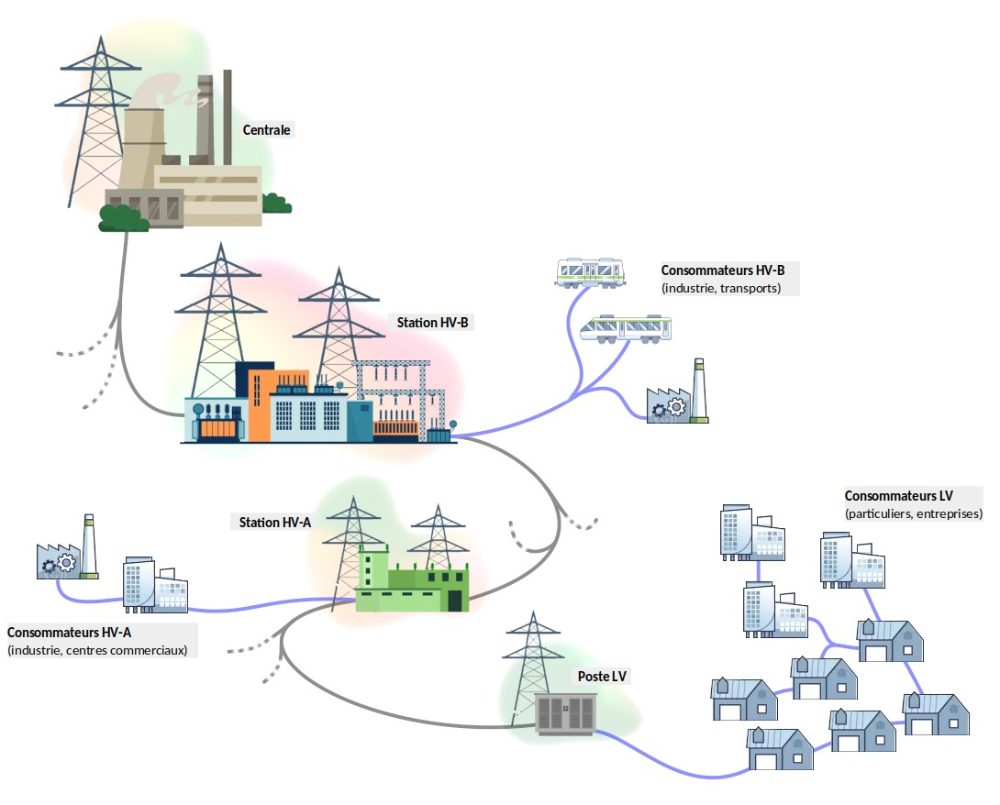

# ⚡ genElec-MEF2-B

**Projet C-WIRE ⚡ — Deuxième année de pré-ingénieur CY Tech, Semestre 1 (2024–2025)**

## 🤝 Collaborateurs
- [Ibrahima Baldé-Cissé](https://github.com/IBBC78)  
- [Jean-Luc Maslanka](https://github.com/JEAN-LUC7)  
- [Gaspard Savès](https://github.com/gaspardsaves)

## 📄 Documentation
- [:scroll: Cahier des charges](Projet_C-Wire_preIng2_2024_2025-v1.4-1.pdf)  
- [:ledger: Rapport de projet](rapport-projet-c-wire-mef2-b.pdf)  
- [:memo: Carnet de bord](carnet-de-bord.txt)


## ⚙️ Description

Ce projet vise à analyser les données d’un réseau de transport d’électricité.  
À partir d’un fichier en entrée, le script permet :
- L’analyse des postes HV-A, HV-B et LV,
- L’évaluation des consommations par secteur (particuliers/entreprises),
- La détection des situations de surcharge/sous-charge,
- Le tri des données selon la centrale de rattachement.




## 🧰 Pré-requis

- **GnuPlot** (pour les histogrammes)  
  Vérification : `gnuplot --version`  
  Installation : `sudo apt install gnuplot`

- **TeX Live avec pdflatex** (pour générer le rapport PDF)  
  Installation : `sudo apt install texlive texlive-latex-extra`

> Ces deux outils sont nécessaires pour la commande `lv all`.

## 🚀 Exécution

1. Attribuer les droits d'exécution au script :  
   `chmod +x c-wire.sh`

2. Lancer le script avec les paramètres souhaités :  
   `./c-wire.sh [options]`

3. Aide et détail des options disponibles avec :  
   `./c-wire.sh -h` ou `--help`

🧪 Fichier de test rapide :  
`./inputs/c-wire_v00.dat`

💡 **Performances** :
- Avec v00 : exécution instantanée
- Avec v25 (9M lignes) : 12 secondes pour `lv all`, 14 sec pour `lv indiv`

📁 Résultats générés :
- `.csv` et rapport PDF dans `outputs/`
- Graphiques dans `graphs/`
- Logs de compilation dans `make.log`
- Logs LaTeX dans `LaTeX.log`

## 📁 Structure du projet

```bash
genElec-MEF2-B/
│
├── codeC/                  # Fichiers sources en C, headers, Makefile
│   │
│   ├── avl.c               # Fonctions utilitaires de l'arbre AVL
│   ├── avl.h
│   ├── lvall.c             # Code source calcul du ratio des postes LV (commande 'lv all')
│   ├── maintreatment.c     # Fonctions principales du traitement des données
│   ├── maintreatment.h
│   ├── Makefile
│   ├── smartrobusnest.c    # Fonctions de robustesse
│   ├── smartrobusnest.h
│   └── structures.h        # Définition de la structure de l'AVL
│
├── inputs/                 # Fichiers de données d’entrée (v00, v25…)
│
├── outputs/                # Résultats : .csv + rapport PDF
│
├── graphs/                 # Histogrammes générés
│
├── latex/                  # Code LaTeX pour le rapport
│   └── lv-pdf.tex          # Template LaTeX pour le rapport PDF
│
├── tests/                  # Exemples de résultats avec v00 et v25
│
├── tmp/                    # Fichiers temporaires générés à l'exécution
│
├── c-wire.sh                           # Script Shell principal du projet
├── script-gnuplot-lv-overload.plt      # Script Gnuplot pour postes en surcharge
├── script-gnuplot-lv-underload.plt     # Script Gnuplot pour postes en sous-charge
├── help.txt                            # Aide utilisateur
│
├── Projet_C-Wire_preIng2_2024_2025-v1.4-1.pdf      # Cahier des charges
├── rapport-projet-c-wire-mef2-b.pdf                # Rapport final
├── carnet-de-bord.txt                              # Suivi du travail de l’équipe
└── reseau.png                                      # Image d'illustration
```

## 🛠️ Compilation

### Compilation classique :
```bash
make -C ./codeC                 # Génère l’exécutable principal 'execdata'
make ratiolv -C ./codeC         # Génère 'execratiolv' pour 'lv all'
make clean -C ./codeC           # Supprime les exécutables
make cleanratiolv -C ./codeC    # Supprime uniquement 'execratiolv'
make cleanfile -C ./codeC       # Supprime les fichiers temporaires
```

## Mode Debug

Un mode debug est prévu pour activer des options comme `fsanitize`, `-Wall`, `-Wextra`.

### Compilation debug :
```bash
make debug -C ./codeC          # Compile avec options debug → 'execdebug'
make cleandebug -C ./codeC     # Supprime l’exécutable de debug
```

⚠️ **Important :** Pour utiliser `execdebug`, modifiez `c-wire.sh` :
- Remplacez `./codeC/execdata` par `./codeC/execdebug`
- Et remplacez `make` et `make clean` par `make debug` et `make cleandebug`